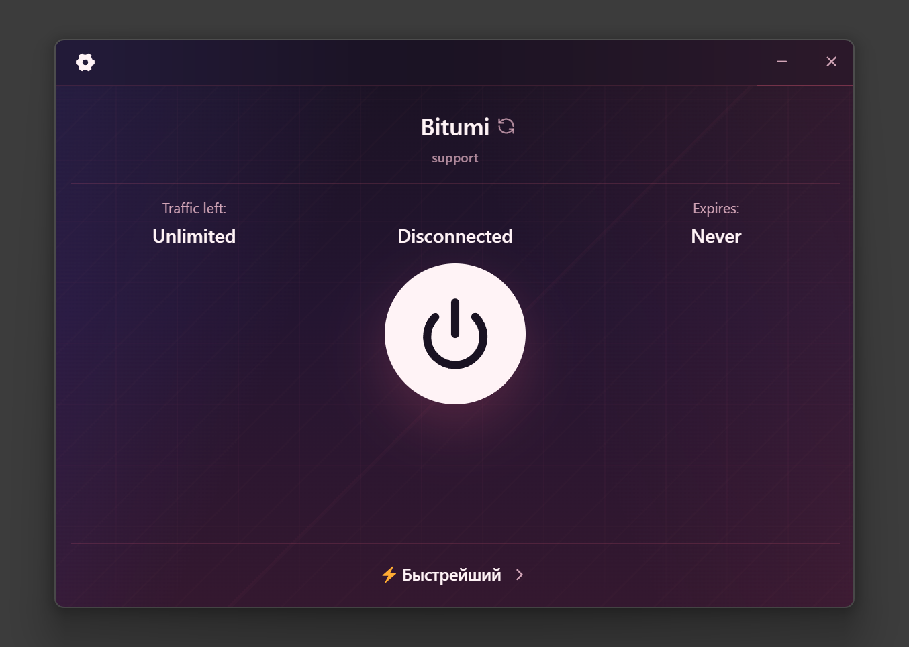
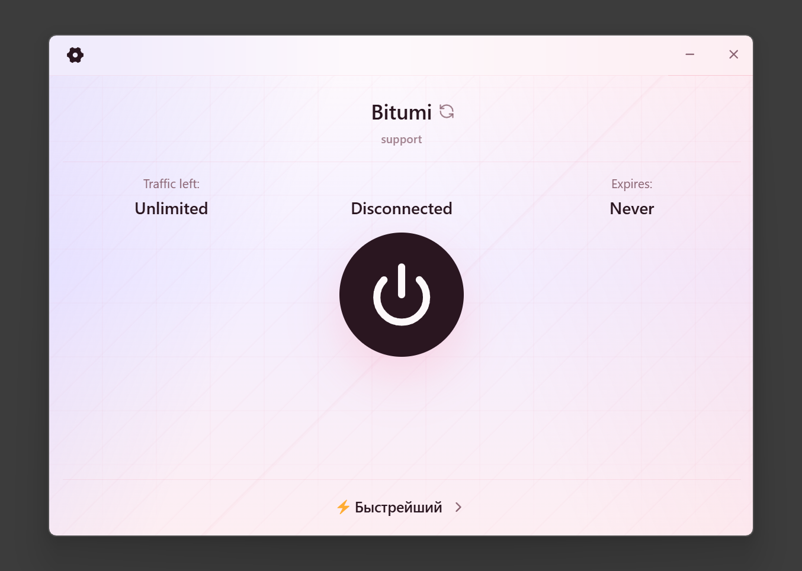
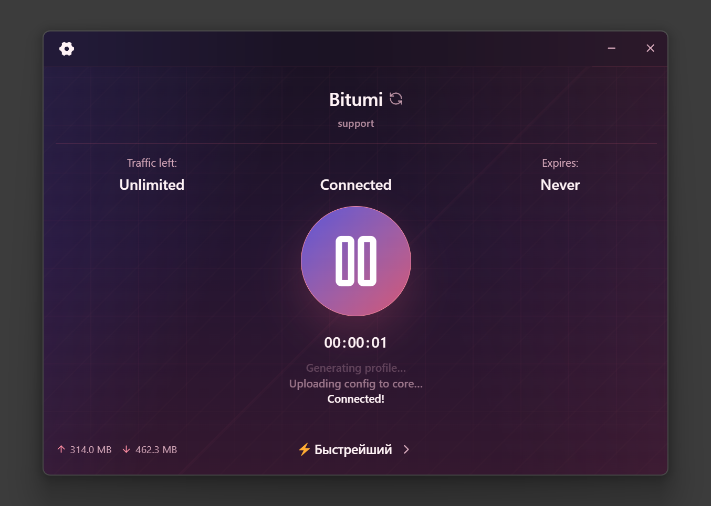
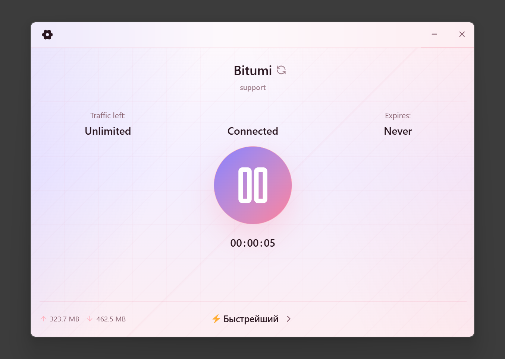

# ClashApp

<p align="center">
  
  <br>
  <br>
  <a href="https://github.com/kirisame-meguru/clashapp/releases">
    
  </a>
</p>

<h3 align="center">Clash App - a visual fork of Koala Clash for <a href="https://github.com/MetaCubeX/mihomo">Mihomo</a></h3>
<h3 align="center"><a href="https://t.me/bitumi_bot">➡️ Bitumi Secure Connection (Bot) ⬅️</a></h3>

## About

`ClashApp` is a visual fork of `Koala Clash`, adapted to the Bitumi ecosystem but built around the idea of being easy to fully customize for everyone's needs.
In terms of functionality, the app stays compatible with the original idea of Koala Clash, but the interface, branding, and usage scenarios have been simplified for everyday users, for general convenience and aesthetics.

## Differences from the upstream repository

- A compact interface with flexible customization by default;
- Removed the confirmation dialog when importing a subscription via Deep Link;
- Simplified the update-check mechanism: updates come directly from the fork's releases;
- The visuals and user flow have been simplified for general use.

## Screenshots

### Original interface


### New interface
|             Dark theme            |            Light theme            |
|:---------------------------------:|:---------------------------------:|
|  |  |
|  |  |

## Installation

For Windows:
- `ClashApp_x64-setup.exe` - regular installer
- `ClashApp_x64-portable.7z` - portable version

### Option 1. Installer

1. Download `ClashApp_x64-setup.exe` from the [Releases](https://github.com/kirisame-meguru/clashapp/releases) page;
2. Run the installer and complete the installation;
3. After installation, the app will appear in the Start menu as `ClashApp`.

### Option 2. Portable

1. Download `ClashApp_x64-portable.7z`.
2. Extract the archive into any folder.
3. Run `ClashApp.exe`.

### If Windows shows a warning

The build may trigger a `SmartScreen` warning because the app is not signed with a paid code-signing certificate.
This is typical behavior for small open-source Electron projects and does not by itself mean the app contains a virus.

If the file was downloaded from this repository's official releases page, you can click `More info` -> `Run anyway`.

## Deeplink for importing a subscription

The fork supports direct subscription import via the scheme:

```text
clashapp://install-config?url=https%3A%2F%2Fexample.com%2Fconnect%2Ftoken&name=ClashApp
```

Where:
- `url` - the url-encoded subscription link (use `encodeURIComponent('...')` in any browser's DevTools)
- `name` - an optional profile name

## Development

### Requirements

- `Node.js` 20+
- `pnpm` 10+
- `Git`
- the `corepack` npm package (for Node.js 25+)

I recommend reviewing the contents of `.\build_win.ps1` before running it, since it installs all of the requirements above for you.

### Quick start

```powershell
git clone https://github.com/kirisame-meguru/clashapp.git
cd clashapp
pnpm install
pnpm run dev
```

### Build

```powershell
pnpm run typecheck
pnpm run build:win
# - OR -
.\build_win.ps1
```

### Debugging (VSCode)

* Open the project in VSCode via `File` > `Open Folder` > `path_to_project`;
* The built files will appear in the `dist/` folder;
* ~~The detailed procedure for releasing a new version is described in [docs/release-guide.md](./docs/release-guide.md).~~

## Stack
- `Electron`
- `React`
- `TypeScript`
- `Mihomo`

## Acknowledgements

This project exists thanks to the work of the authors of the original projects:

- [coolcoala/koala-clash](https://github.com/coolcoala/koala-clash) - the basis of this fork
- [JKmake/koala-clash-guar-styled](https://github.com/coolcoala/koala-clash) - the repository it was originally lifted from, because I liked the design
- [xishang0128/sparkle](https://github.com/xishang0128/sparkle) - the project Koala Clash was originally based on

If you like `ClashApp`, please don't forget about the authors of the original software too.
Without their work, this fork would not exist.
